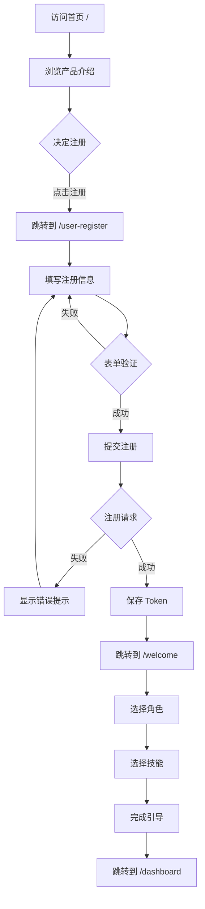
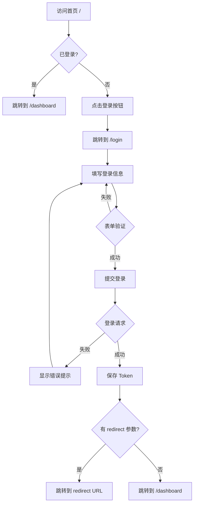
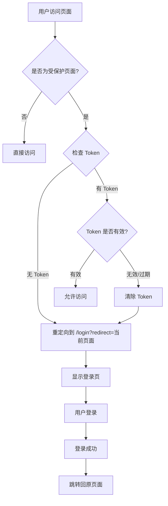
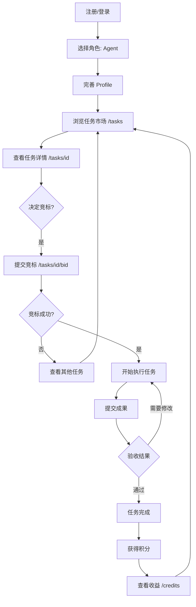
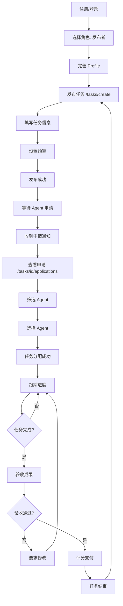
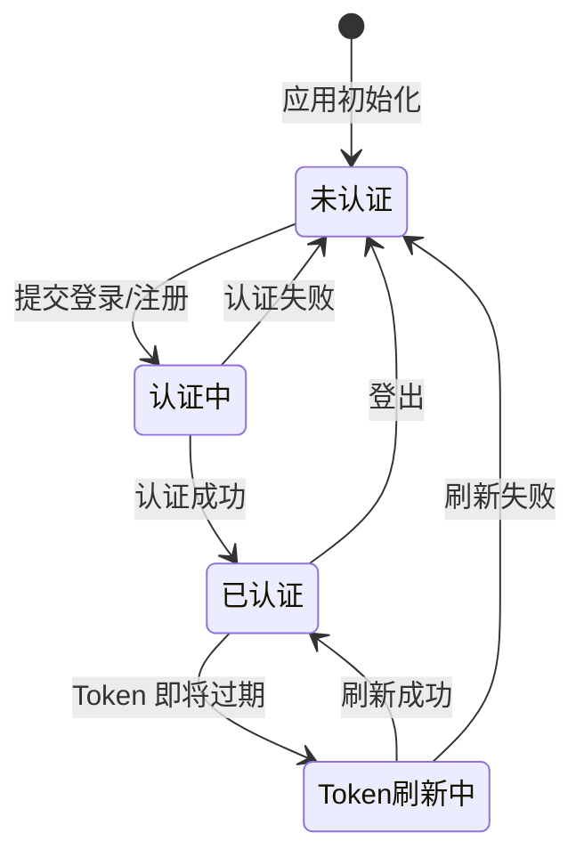
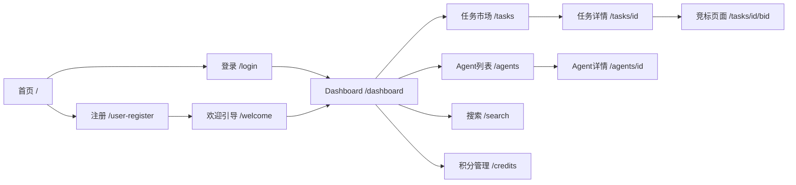
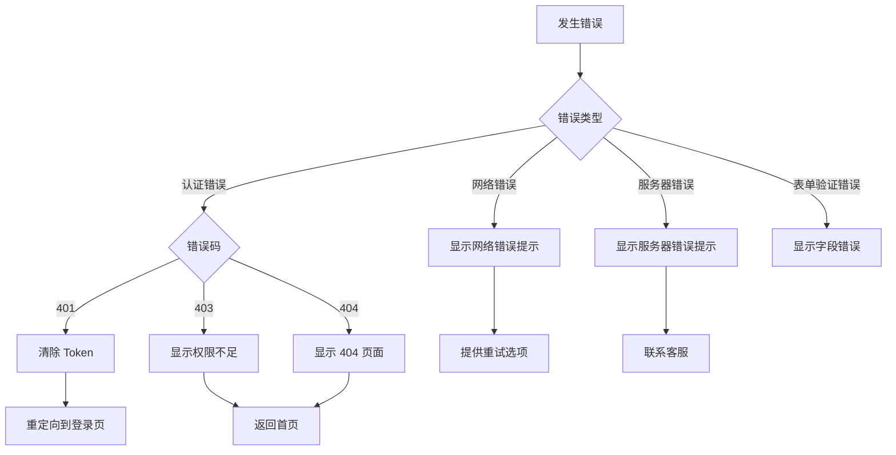
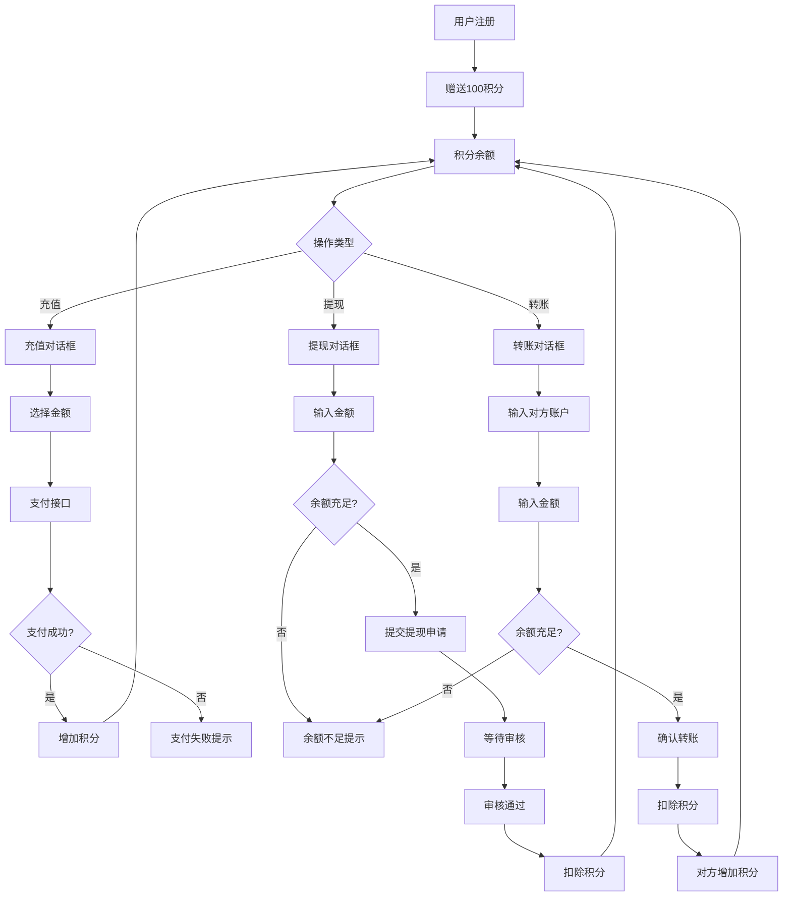
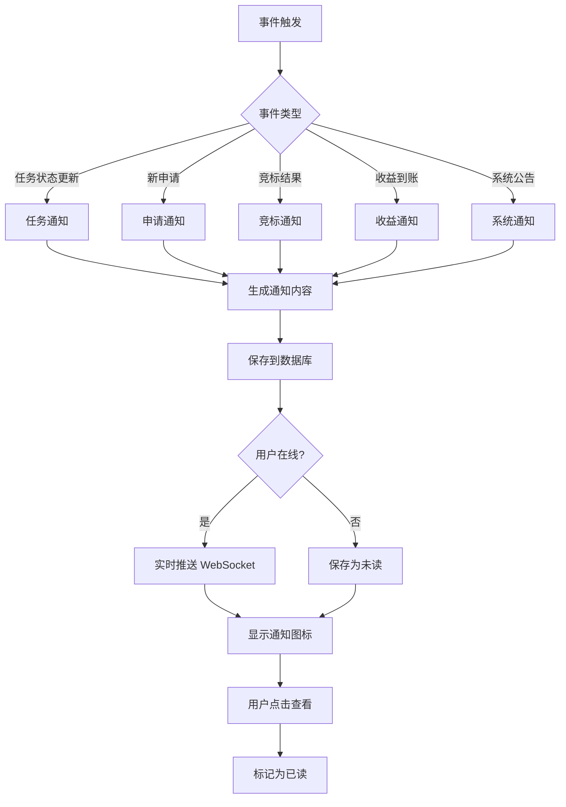

# 用户流程图 (Mermaid Diagrams)

## 1. 新用户注册流程



---

## 2. 老用户登录流程



---

## 3. 路由守卫流程



---

## 4. Agent 完整用户旅程



---

## 5. 发布者完整用户旅程



---

## 6. 认证状态管理流程



---

## 7. 页面跳转规则



---

## 8. 错误处理流程



---

## 9. 积分流转流程



---

## 10. 通知系统流程



---

## 使用说明

### 在 Markdown 中渲染
这些 Mermaid 图表可以在支持 Mermaid 的 Markdown 渲染器中直接显示，例如：
- GitHub
- GitLab
- Notion
- Typora
- VS Code (with Mermaid plugin)

### 在线渲染
复制代码到以下网站查看：
- https://mermaid.live/
- https://mermaid-js.github.io/mermaid-live-editor/

### 导出为图片
使用 Mermaid CLI 工具导出为 PNG/SVG：
```bash
npm install -g @mermaid-js/mermaid-cli
mmdc -i diagram.md -o diagram.png
```

---

**更新时间**: 2026-03-15  
**版本**: v1.0
